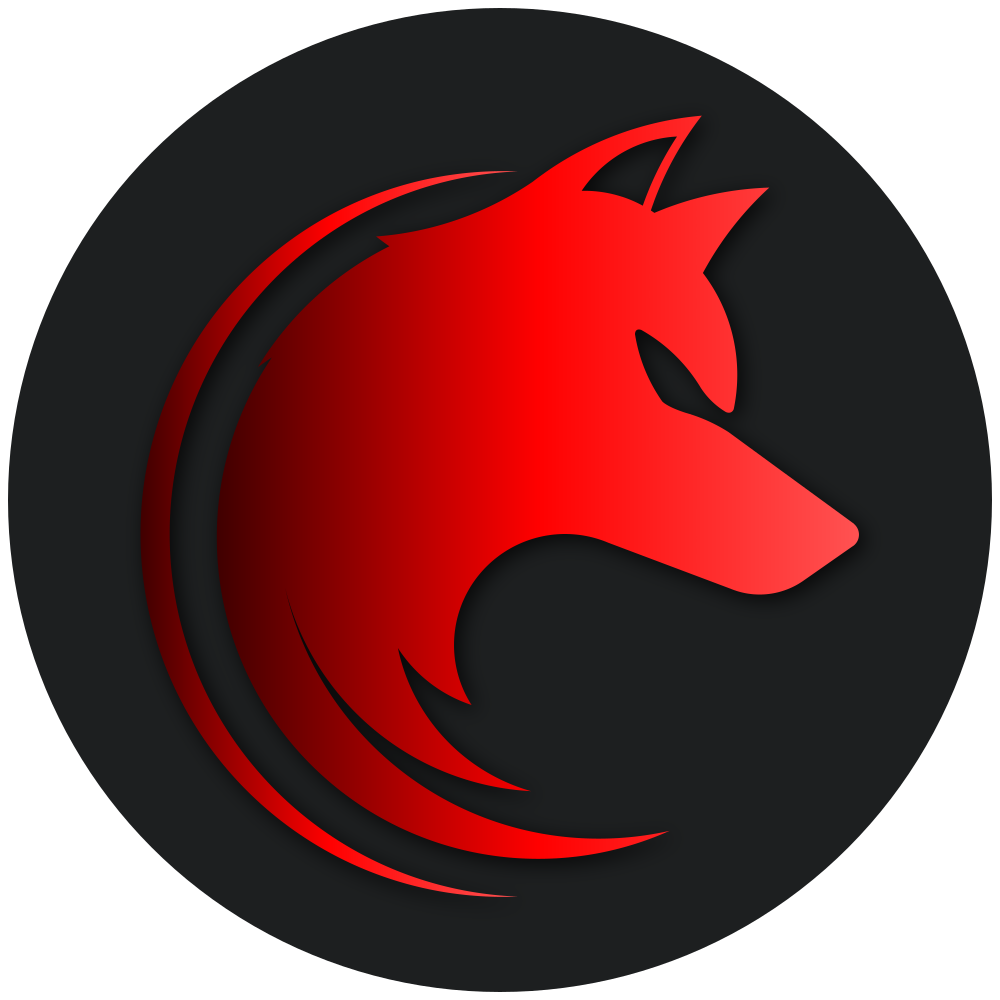

<!-- markdownlint-disable MD033 -->
<h1 align="center">Wolves League Windows Terminal theme</h1>

<p align="center">
  
</p>
<p align="center">Official <strong><a href="https://github.com/WolvesLeague">Wolves League</a></strong> Gnome Terminal theme.</p>

---

A beautiful theme for those who like the color red. Red is used as accent color paired with grey and black backgrounds, so it's not tiring to look at.

## Colors and variants

There are 2 variants:

- **Dark** - Dark grey background
- **Black** - Pure black background


## Install instructions

Click on the down arrow symbol `˅` at the top of the terminal and then select ***Settings***. If you prefer you can use the keyboard shortcut `Ctrl + ,`. In the tab that just opened click on ***Open JSON file***.

Find the `schemes` section and paste the content of `wolves-league-black.json` and `wolves-league-dark.json` if you want both Black and Dark themes, or paste only the one you want.

**Example**:
```json
"schemes": 
    [
      {
          "name": "Wolves League Black",
          "background": "#000000",
          "black": "#222425",
          "blue": "#6CAEFF",
          "brightBlack": "#707070",
          "brightBlue": "#9AC5FB",
          "brightCyan": "#7CD4E5",
          "continues": "..."
      },
      {
          "name": "Wolves League Dark",
          "background": "#1D1F20",
          "black": "#222425",
          "blue": "#6CAEFF",
          "brightBlack": "#707070",
          "brightBlue": "#9AC5FB",
          "brightCyan": "#7CD4E5",
          "continues": "..."
      },
    ]
```


### **Enabling the theme**

Find the `profiles` section and add a `colorScheme` property with the name of the theme you want.

**Example**:
```json
"profiles": {
    "defaults": {
      "colorScheme": "Wolves League Dark"
    },
  }
```

## Issues and suggestions

For issues and suggestions use [GitHub Issues](https://github.com/WolvesLeague/wolves-league-windows-terminal-theme/issues).
